# ANOTOMY — the human body in true 3D

An interactive, photoreal 3D human anatomy atlas that runs in the browser and is built and
deployed entirely from this repository.

- **Two real bodies** — a male body (Z-Anatomy + BodyParts3D, 2,700+ structures) and a female
  body (HuBMAP Human Reference Atlas, 870+ structures), derived from real imaging data (MRI /
  Visible Human), not artist mock-ups.
- **Every system** — skin, skeleton (bones, teeth, joints, ligaments), muscles (with tendons,
  fascia, bursae), heart and vessels, brain / spinal cord / peripheral nerves, eye & ear,
  respiratory, digestive, urinary, reproductive, endocrine, lymphatic (100+ lymph-node groups).
- **Region dissection** — click the neck (or any of 22 regions) and the camera flies in while the
  rest of the body is hidden and structures crossing the boundary are cut away.
- **Structure by structure** — click a muscle: it lights up, and the left panel shows its name,
  Latin (Terminologia Anatomica) name, origin, insertion, action, innervation, blood supply and a
  clinical note, with 🔊 buttons that pronounce the English and Latin names. Drag it (grab-hand
  cursor) or use ← → to pull it out of the body, hide it, isolate it, or explode the whole region.
- **Down to the cell** — the Micro explorer shows dimensionally accurate models of red and white
  blood cells, platelets, a cell with its organelles, a myelinated neuron, the sarcomere, an osteon,
  a capillary with flowing blood and the DNA double helix.
- **Photoreal rendering** — physically based tissue materials with procedural micro-detail (muscle
  fibres follow each muscle's own axis, porous bone, skin pores, wet clearcoat on viscera), image-based
  lighting, soft shadows, ground-truth ambient occlusion, and a one-click **3840×2160 (4K)** capture.

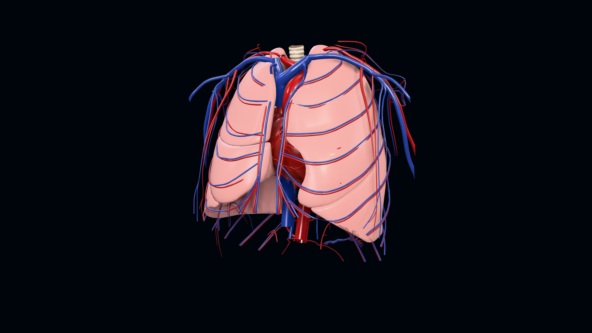

<sub>Above: an unretouched frame from the app's **Save 4K image** button (3840×2160). Below: screenshots of the running site.</sub>

| | |
|---|---|
| 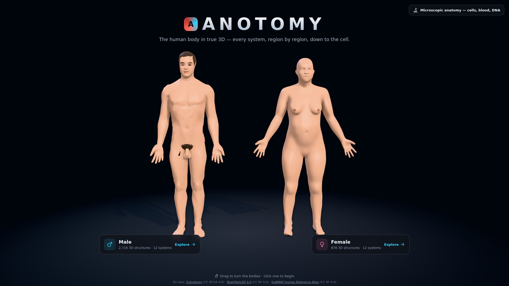 | 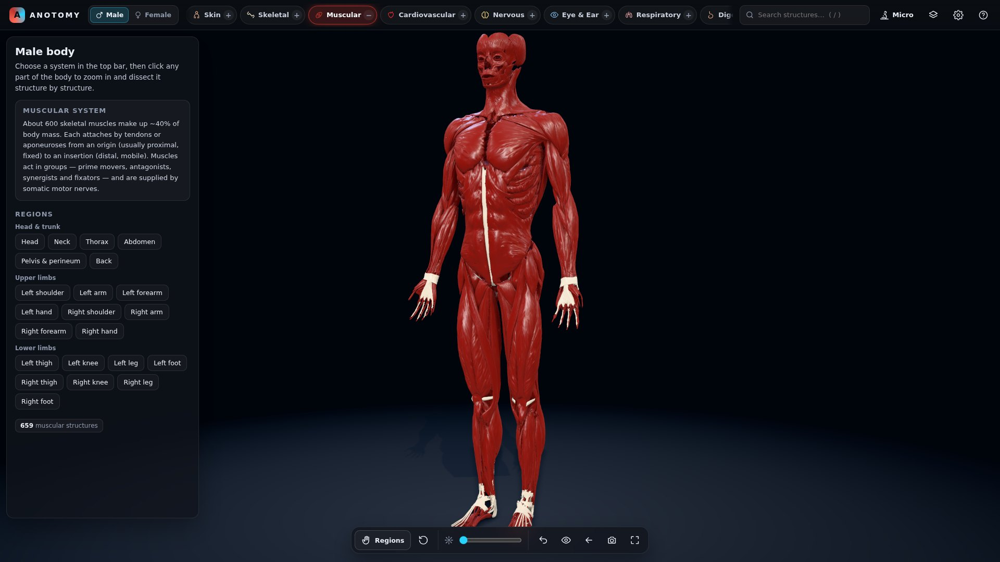 |
| **Start** — pick the male or female body | **Muscular system** — every muscle, tendon and fascia |
| 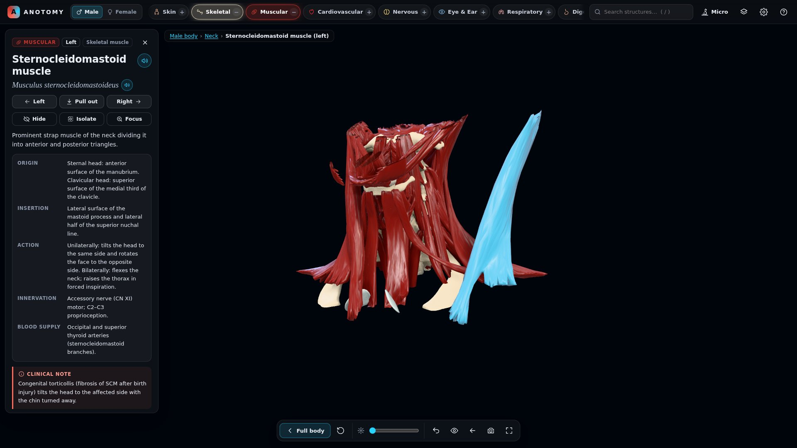 | 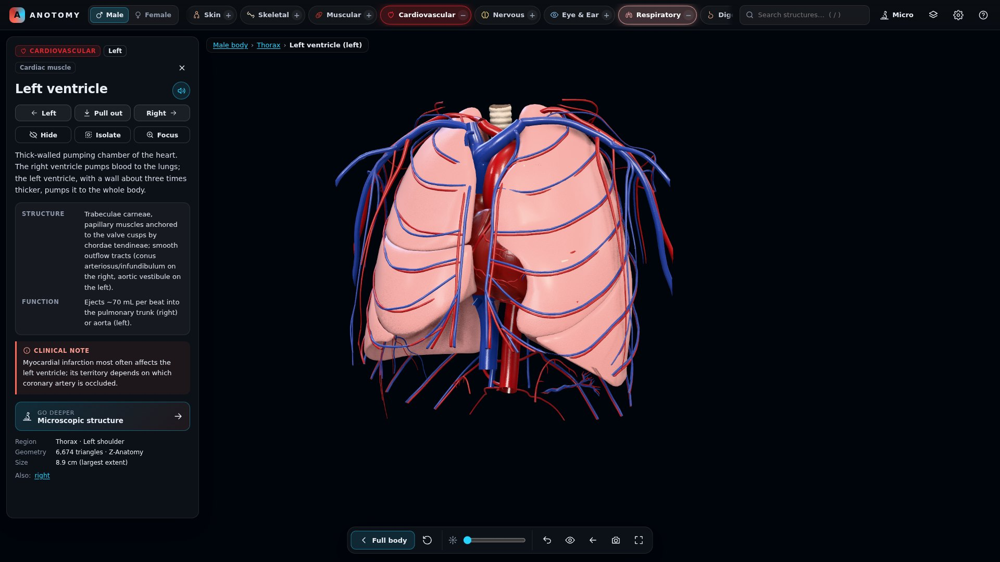 |
| **Neck dissection** — platysma removed, SCM selected, moved aside, info and pronunciation on the left | **Thorax** — lungs, heart and great vessels |
| 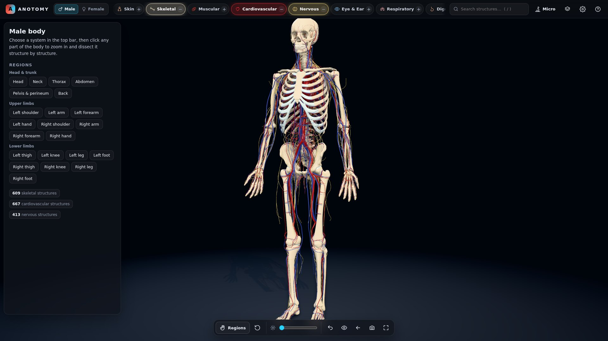 | 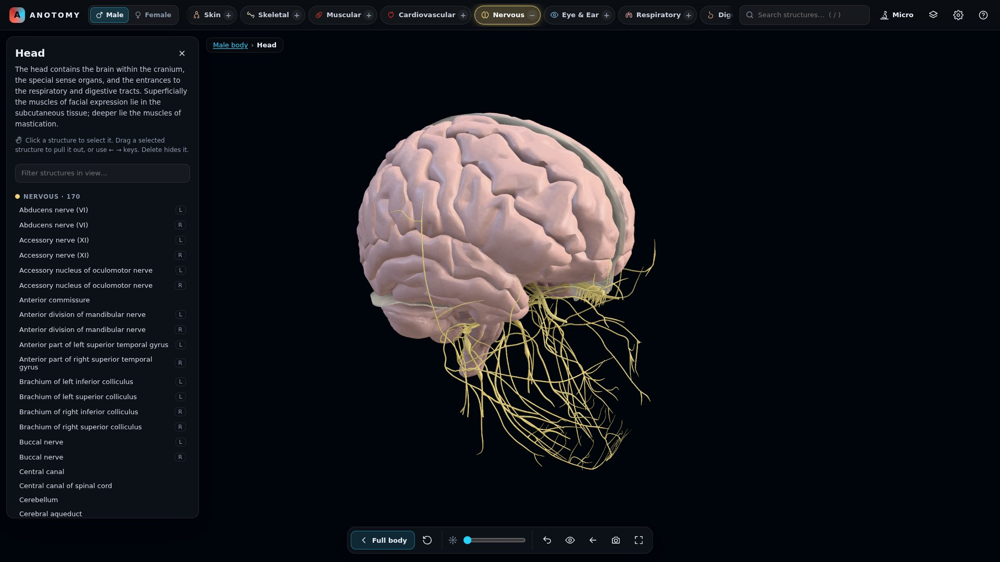 |
| **Layered systems** — skeleton + cardiovascular + nervous | **Head** — brain, cranial nerves and nuclei |
| 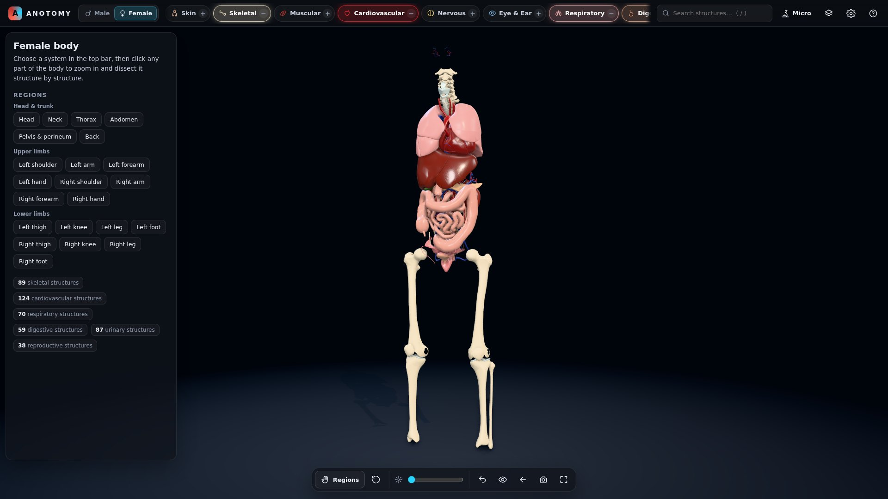 | 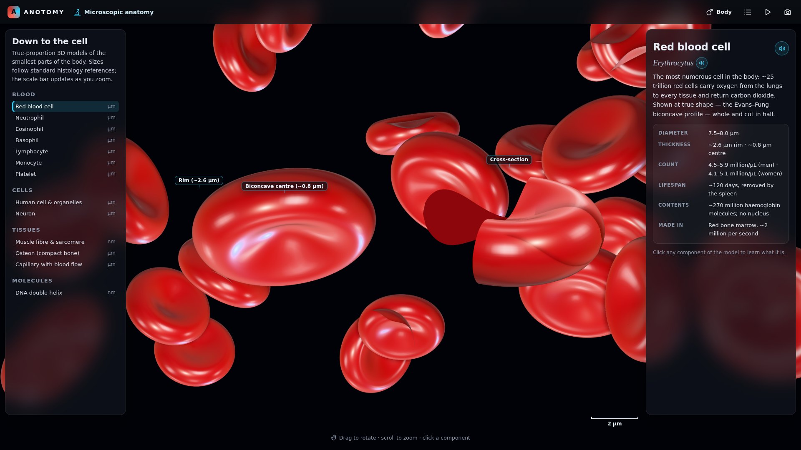 |
| **Female body** — organs and skeleton (HuBMAP HRA) | **Red blood cells** — true Evans–Fung biconcave shape |
| 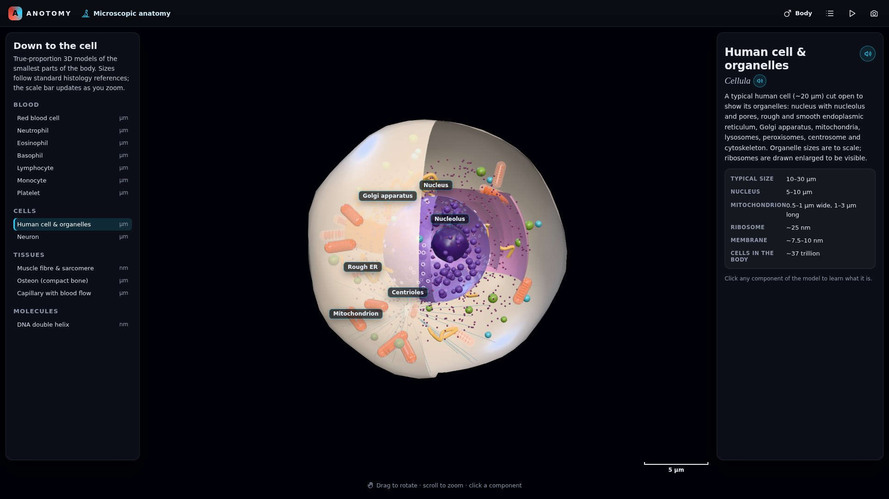 | 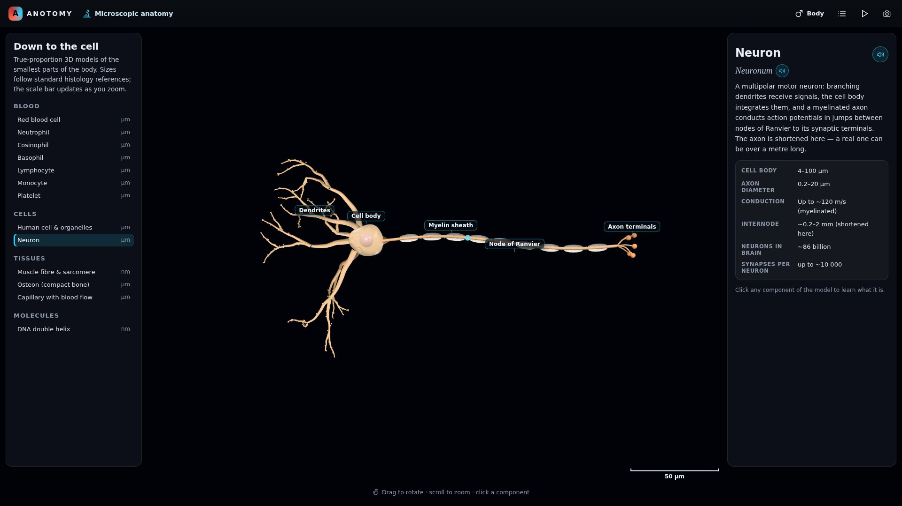 |
| **Cell** — nucleus, ER, Golgi, mitochondria … | **Neuron** — dendrites, myelin, nodes of Ranvier |
| 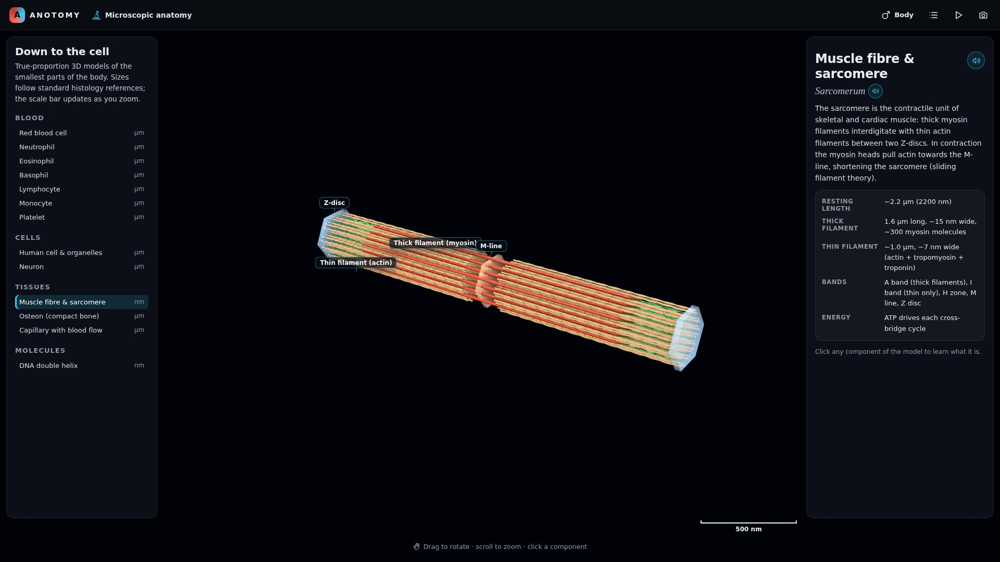 | 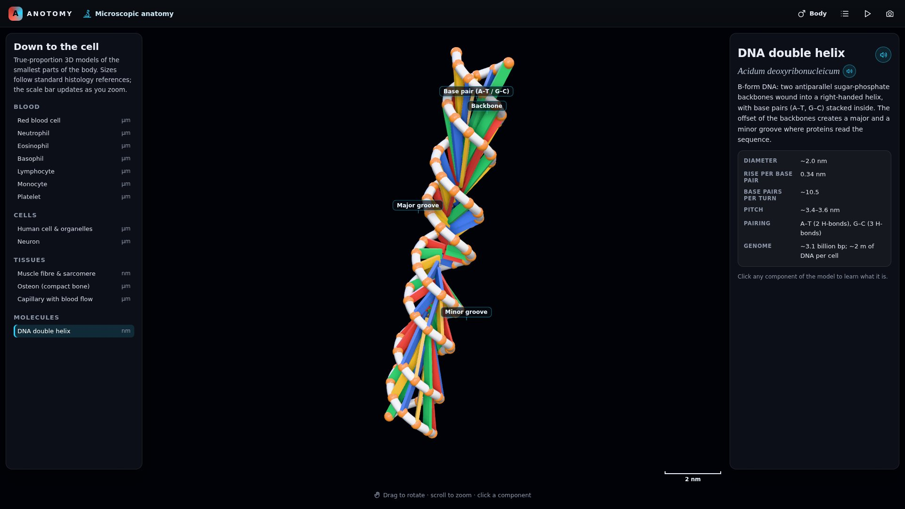 |
| **Sarcomere** — actin / myosin lattice, Z-discs | **DNA** — B-form helix, major and minor grooves |

## Run locally

```bash
npm ci
npm run dev        # http://localhost:5173
npm run build      # type-check + production build into dist/
```

Checks (with `npm run dev` running in another terminal):

```bash
npm run kb:check   # knowledge-base coverage of every 3D structure
npm run e2e        # headless-Chromium walk through the whole explorer (42 assertions)
npm run shots      # re-render the README images into docs/images/
```

The 3D assets in `public/models/` are committed, so nothing else is needed to run the site.

## Deploy (GitHub Pages)

`.github/workflows/deploy.yml` builds and publishes the site on every push to `main`.
Enable it once: **Settings → Pages → Build and deployment → Source: GitHub Actions**.
The site is then served at `https://<user>.github.io/<repo>/`.

## Rebuild the 3D assets

```bash
npm run assets     # = assets:fetch (pinned upstream sources → .cache/) + assets:build
```

`tools/` contains the whole data pipeline:

| Script | What it does |
|---|---|
| `fetch-sources.mjs` | Downloads the pinned upstream geometry (Z-Anatomy, BodyParts3D 4.0, HuBMAP HRA female v1.5). |
| `lib/classify.mjs` | Assigns every mesh to a body system, tissue (material) and sub-layer; cleans names and sides. |
| `lib/register.mjs` | ICP + displacement-field registration of BodyParts3D parts onto the Z-Anatomy skeleton. |
| `lib/skinfit.mjs` | Removes the inner skin shell and fits the skin around the musculature. |
| `lib/regions.mjs` | Builds 22 anatomical regions from skeletal/skin landmarks and measures each structure's share. |
| `lib/gltf.mjs` | meshoptimizer simplification + quantisation + EXT_meshopt_compression GLB output. |
| `build-assets.mjs` | Runs everything and writes `public/models/<sex>/<system>.glb` + `manifest.json`. |

## Project layout

```
src/
  app/        app shell & router, landing page, body explorer
  body/       manifest types, lazy system loading, visibility / regions / dissection state
  render/     renderer (lighting, shadows, GTAO, tone mapping, 4K capture), tissue materials, camera
  ui/         info panel, speech (pronunciation), icons, overlays
  kb/         knowledge base (original text) + resolver that maps meshes to entries
  micro/      microscopic explorer (cells, blood, DNA …)
public/
  models/     compressed GLB per system + manifest, male and female
  data/       fallback definitions (Wikipedia, CC BY-SA)
tools/        asset pipeline and screenshot helpers
```

## Accuracy and references

Descriptions are original educational summaries checked against the standard references —
Netter's *Atlas of Human Anatomy* (8e), Moore *Clinically Oriented Anatomy* (9e), *Gray's Anatomy
for Students* (5e), *Grant's Atlas* (15e), Rohen's *Photographic Atlas* (9e) and *BD Chaurasia's
Human Anatomy* (9e). No text or figures are copied from these books. The 3D shapes come from
imaging-based datasets, not from the books. This atlas is for education, not diagnosis.

## Licence

Code: MIT. 3D data and texts: see [ATTRIBUTION.md](ATTRIBUTION.md) (male model CC BY-SA 4.0,
female model CC BY 4.0).
